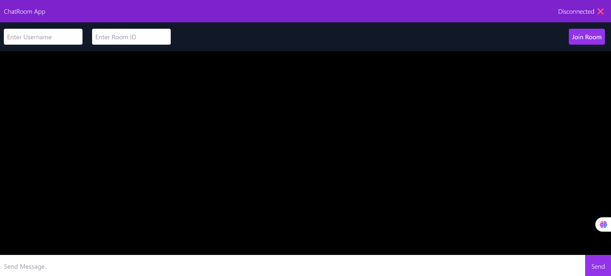
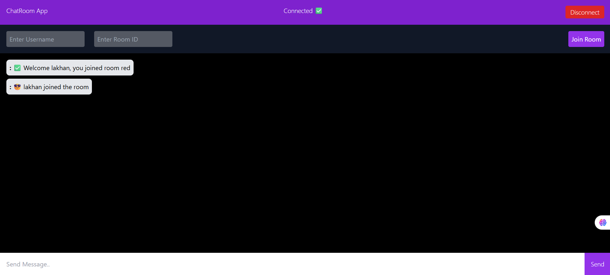
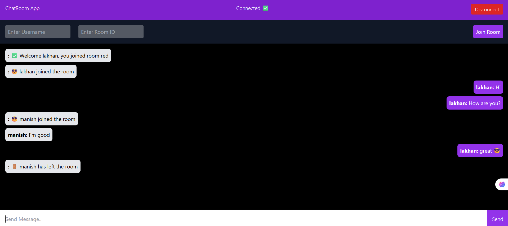

# Chat Room App 💬

A real-time chat application where users can join rooms and communicate instantly.
Built with React (TypeScript) on the frontend and Node.js + WebSocket (ws) on the backend.

---

## 🌟 Features

- 🔐 Room-based chats – Users can join specific rooms and chat only with members inside.
- 🧑‍🤝‍🧑 Username support – Every message is tagged with the sender’s name.
- 📡 Real-time communication – Powered by WebSockets (ws library).
- 🌓 Clean UI – Built with TailwindCSS, responsive design.
- 🔄 Auto-scroll – Chat window scrolls to the latest message.
- 🛠 Connection status indicator – Shows “Connected ✅ / Disconnected ❌”.

---

## 📂 Project Structure

```text
chat-room-app/
├── backend/        # Node.js API + WebSocket (ws) 
├── frontend/       # React frontend with tailwind
├── .gitignore
├── README.md
└── package.json
```

---

## ⚡ Tech Stack

- **Frontend**: React, TypeScript, Tailwind CSS  
- **Backend**: Node.js, WebSocket (ws)  
- **Language**: TypeScript (end-to-end)
- **Version Control**: Git + GitHub  

---

## 🚀 Getting Started

### Prerequisites

- Node.js(>=18)
- npm or yarn

---

## ⚙️ Setup Instructions

### 1️⃣ Clone the Repository

```bash
git clone https://github.com/Lakhan3011/chat_room_app.git
cd chat_room_app
```

### 2️⃣ Backend Setup

```bash
cd backend
npm install
```

### 3️⃣ Frontend Setup

```bash
cd frontend
npm install
```

## 📸 Screenshots

- 
- 
- 


## 📚 Learning Highlights

### This project helped me practice:

- WebSocket protocol basics (message types, broadcasting).
- Managing state & refs in React with `useState`, `useRef`, and `useEffect`.
- Structuring full-stack TypeScript projects.
- Building real-time features with graceful handling of connect/disconnect events.

## 🤝 Contribution

Feel free to fork this repo, create issues, or submit PRs for improvements!
Your contributions are always welcome!

## 👨‍💻 Author

- Lakhan Rajput - [LinkedIn↗️](https://www.linkedin.com/in/lakhan-rajput-7853a521a/).